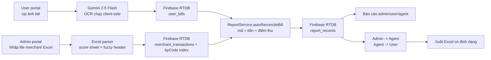

# Mini Reconcile - Đối soát thanh toán bằng AI

[Read in English](README.md)


Mini Reconcile là hệ thống đối soát thanh toán chạy trên trình duyệt: người dùng up ảnh bill, đại lý theo dõi công nợ, admin nhập file merchant Excel và kết luận giao dịch nào khớp, giao dịch nào sai, giao dịch nào còn chờ dữ liệu.

Điểm khó của dự án không nằm ở chuyện gọi OCR. Điểm khó là giữ được một đường đối soát đáng tin khi cùng một mã chuẩn chi có thể đi qua ảnh VNPay/POS/App Bank, file Excel merchant, chỉnh sửa thủ công, báo cáo công nợ, lô chi trả và cả các luồng legacy còn tồn tại trong code.

## Xem trước


Ảnh đã kiểm tra bằng Playwright:

- [Màn hình đăng nhập admin](docs/assets/admin-login-current.png)
- [Màn hình đăng nhập user](docs/assets/user-login-current.png)

## Hệ thống làm gì?

- Đọc ảnh thanh toán bằng Gemini Vision và trích xuất `transactionCode`, `amount`, `paymentMethod`, `invoiceNumber`, `pointOfSaleName`, `bankAccount`, `timestamp`.
- Lưu users, agents, merchants, bills, merchant transactions, report records, payments, batches và settings trên Firebase Realtime Database.
- Nhập file merchant Excel bằng cơ chế chấm điểm sheet, nhận diện header mờ, chuẩn hóa số tiền, chống duplicate và tạo index theo mã chuẩn chi.
- Đối soát bill của user với giao dịch merchant theo 3 trụ: mã chuẩn chi, số tiền, điểm thu.
- Tách riêng bill đang chờ file merchant khỏi các record đã có bằng chứng merchant-side.
- Có khu admin, user, agent; có báo cáo công nợ, lịch sử bill, thanh toán admin -> agent, thanh toán agent -> user.
- Xuất Excel có metadata, sheet báo cáo và auto-size cột.

## Trạng thái sản phẩm hiện tại

Mini Reconcile là một Vite SPA có ba vai trò:

| Vai trò | Route chính | Trách nhiệm |
|---|---|---|
| Admin | `/admin`, `/reconciliation`, `/merchants`, `/agents`, `/payouts`, `/reports`, `/settings`, `/admin/report` | Nhập file merchant, chạy đối soát, quản lý đại lý/điểm bán/user, xuất báo cáo, gom lô chi trả |
| User | `/user/login`, `/user/register`, `/user/upbill`, `/user/report`, `/user/payment`, `/user/utilities` | Up bill, nhập Gemini API key, xem trạng thái, cấu hình thông tin nhận thanh toán |
| Agent | `/agent/login`, `/agent/report`, `/agent/reconciliation/:sessionId`, `/agent/payment`, `/agent/admin-payment`, `/agent/utilities` | Theo dõi giao dịch được gán, kiểm tra trạng thái đối soát và thanh toán |

Đăng nhập admin hiện là mock-local qua `localStorage.mockAuth`. User và agent đăng nhập bằng lookup tự viết trên Firebase Realtime Database. Firebase Auth có khởi tạo persistence nhưng chưa phải lớp phân quyền chính của các luồng user/agent.

## Tech Stack

| Layer | Stack |
|---|---|
| Frontend |    |
| Build |  |
| UI |   |
| Database |  |
| AI/OCR |  |
| Spreadsheet |   |
| Deploy |  |

## Kiến trúc



`report_records` là snapshot đối soát, không chỉ là view tạm. Nó giữ lại dữ liệu bill và merchant tại thời điểm reconcile để sau này chỉnh bill, đổi merchant hay xóa session không làm mất lịch sử kết luận.

## Chạy local

```bash
npm install
npm run dev
```

Theo `vite.config.ts`, dev server mặc định chạy:

```text
http://localhost:3001
```

Build production:

```bash
npm run build
```

Gemini OCR hoạt động khi user:

- dán Gemini API key vào màn upload bill, lưu trong `localStorage` với key `payreconcile:geminiApiKey`; hoặc
- cấu hình `VITE_GEMINI_API_KEY` / `GEMINI_API_KEY`.

## Tài liệu sâu

- [Đặc tả kỹ thuật](docs/01-technical-specification.md)
- [Luồng nghiệp vụ và vận hành](docs/02-workflows-and-operations.md)
- [Ghi chú bảo trì và risk register](docs/03-maintenance-and-risk-register.md)

## Trạng thái đã kiểm tra

- `npm ci` chạy thành công.
- `npm run build` chạy thành công.
- Screenshot được chụp lại bằng Playwright từ Vite dev server local.
- Repo hiện không có GitHub Actions workflow, nên commit `[skip ci]` không kích hoạt CI/CD tự động từ repo này.

Các cảnh báo build còn tồn tại được ghi rõ trong tài liệu bảo trì: bundle lớn, `reportServices.ts` vừa import tĩnh vừa import động, và `index.html` còn tham chiếu `/index.css`.
