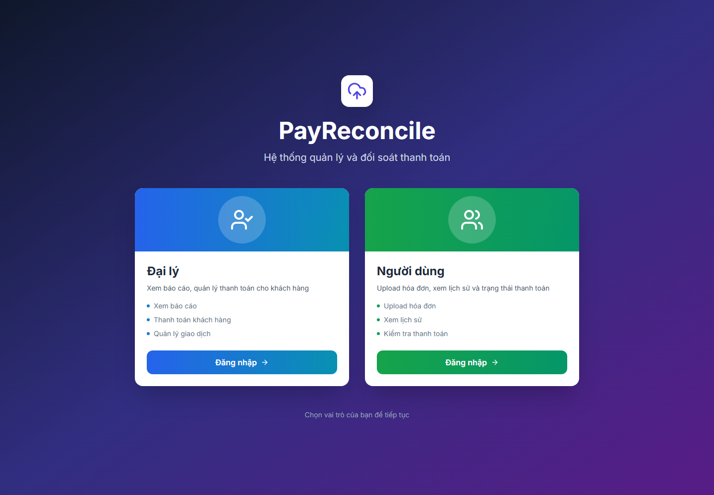
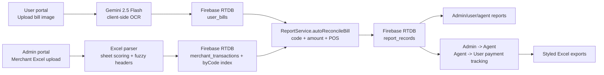

# Mini Reconcile - AI Payment Reconciliation

[Đọc bằng tiếng Việt](README-vi.md)


Mini Reconcile is a browser-first reconciliation system for payment networks where end users upload payment receipts, agents manage downstream payouts, and admins reconcile those receipts against merchant Excel exports.

The main engineering problem is not OCR alone. The difficult part is preserving a reliable reconciliation trail when the same transaction code can appear from a phone screenshot, a merchant settlement file, a manual correction, a payment batch, and a legacy record path at different times.

## Preview



More verified screenshots:

- [Admin login](docs/assets/admin-login-current.png)
- [User login](docs/assets/user-login-current.png)

## What The System Does

- Reads payment screenshots with Gemini Vision and extracts `transactionCode`, `amount`, `paymentMethod`, `invoiceNumber`, `pointOfSaleName`, `bankAccount`, and `timestamp`.
- Stores users, agents, merchants, uploaded bills, merchant transactions, reports, payments, batches, and settings in Firebase Realtime Database.
- Imports merchant Excel files with header scoring, fuzzy column matching, amount normalization, duplicate detection, and transaction-code indexing.
- Reconciles user bills against merchant transactions by transaction code, amount, and point-of-sale name.
- Separates bills still waiting for a merchant file from records that already have merchant-side evidence.
- Supports admin reporting, agent reports, user bill history, admin-to-agent payment tracking, and agent-to-user payment tracking.
- Exports styled Excel reports with metadata sheets and auto-sized columns.

## Current Product Shape

Mini Reconcile is a Vite single-page app with three visible roles:

| Role | Routes | Main responsibility |
|---|---|---|
| Admin | `/admin`, `/reconciliation`, `/merchants`, `/agents`, `/payouts`, `/reports`, `/settings`, `/admin/report` | Upload merchant Excel files, reconcile records, manage agents/merchants/users, export reports, prepare payout batches |
| User | `/user/login`, `/user/register`, `/user/upbill`, `/user/report`, `/user/payment`, `/user/utilities` | Upload bills, provide Gemini API key, review status, configure payout utility data |
| Agent | `/agent/login`, `/agent/report`, `/agent/reconciliation/:sessionId`, `/agent/payment`, `/agent/admin-payment`, `/agent/utilities` | Review assigned transactions and payment status |

Admin login is currently mock-local (`localStorage.mockAuth`). User and agent login are custom Firebase Realtime Database lookups. Firebase Auth is initialized for persistence, but it is not the active authorization boundary for user/agent flows.

## Tech Stack

| Layer | Stack |
|---|---|
| Frontend |    |
| Build |  |
| UI |   |
| Data store |  |
| AI/OCR |  |
| Spreadsheet |   |
| Deploy |  |

## Architecture



The code intentionally keeps reconciliation records as snapshots. A `report_record` duplicates selected bill and merchant fields so later edits to the source bill or merchant row do not erase the historical reconciliation result.

## Run Locally

```bash
npm install
npm run dev
```

Default Vite config uses port `3001`:

```text
http://localhost:3001
```

Build:

```bash
npm run build
```

Gemini OCR works when a user either:

- pastes a Gemini API key into the upload screen, stored as `payreconcile:geminiApiKey` in `localStorage`; or
- provides `VITE_GEMINI_API_KEY` / `GEMINI_API_KEY` at build/runtime.

## Documentation

- [Technical specification](docs/01-technical-specification.md)
- [Workflows and operations](docs/02-workflows-and-operations.md)
- [Maintenance notes](docs/03-maintenance-and-risk-register.md)

## Verified State

- `npm ci` completed.
- `npm run build` completed.
- Playwright screenshots were captured from the local Vite app.
- No GitHub Actions workflow exists in this repo at the time of this documentation pass.

Build warnings remain and are documented in the maintenance notes: large bundle size, mixed static/dynamic import of `reportServices.ts`, and a retained `/index.css` reference in `index.html`.
