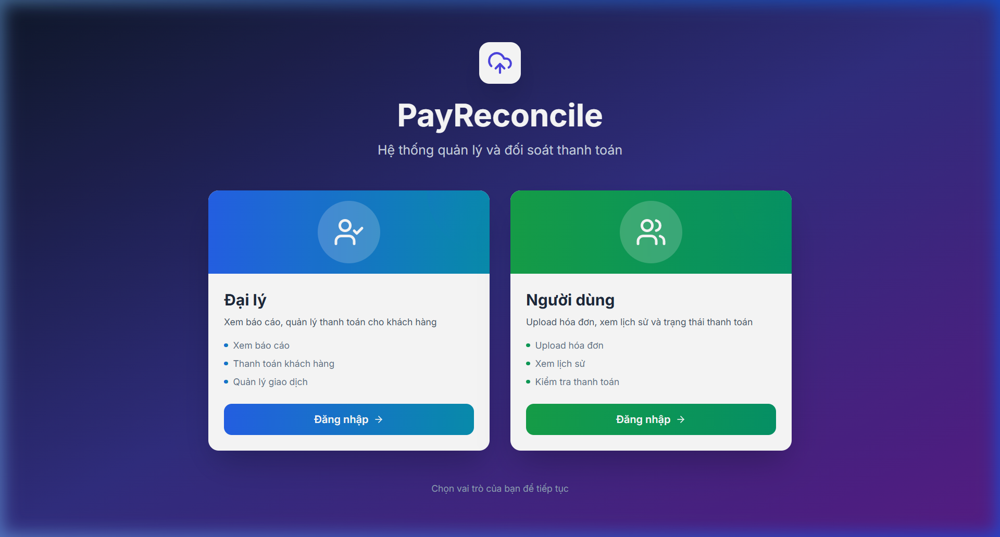

🇻🇳 [Đọc bằng tiếng Việt](README-vi.md)

# Mini Reconcile — AI Transaction Reconciliation

    

An AI-powered tool that uses OCR and Gemini API to automatically reconcile financial transactions from scanned documents against digital records.

## Preview



## What it does

- **OCR document scanning** — extract transaction data from images/PDFs
- **AI matching engine** — Gemini API matches scanned entries to database records
- **Discrepancy detection** — highlights mismatches, missing entries, amount differences
- **Export to Excel** — reconciliation reports in xlsx format with formatting

## Getting started

```bash
git clone https://github.com/initforge/mini-reconcile.git
cd mini-reconcile
npm install
npm run dev  # Requires Gemini API key in env
```

---

**Xuan Linh** — Fullstack Developer

[](https://github.com/initforge) [](https://linkedin.com/in/linhnx-dev)
