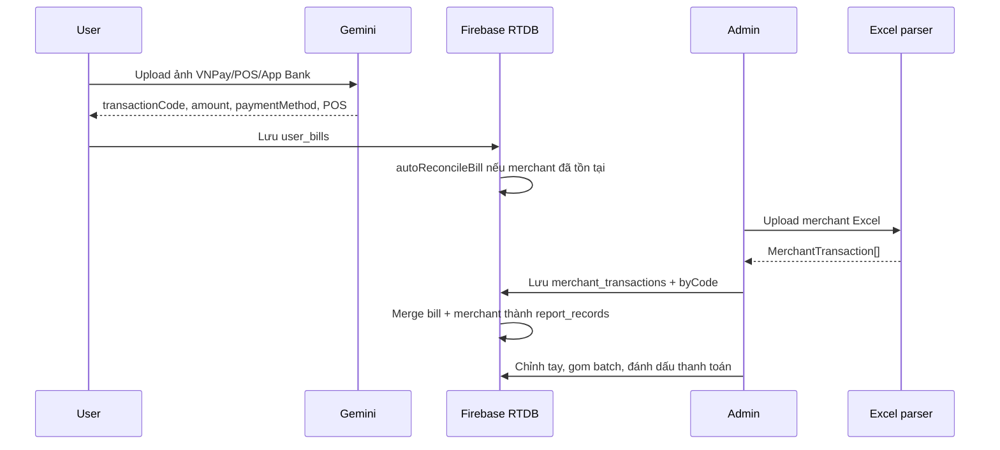
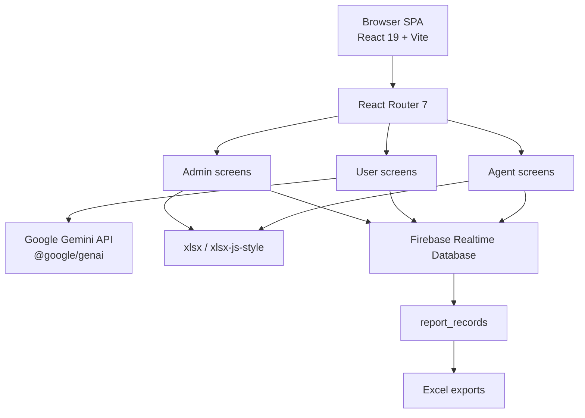
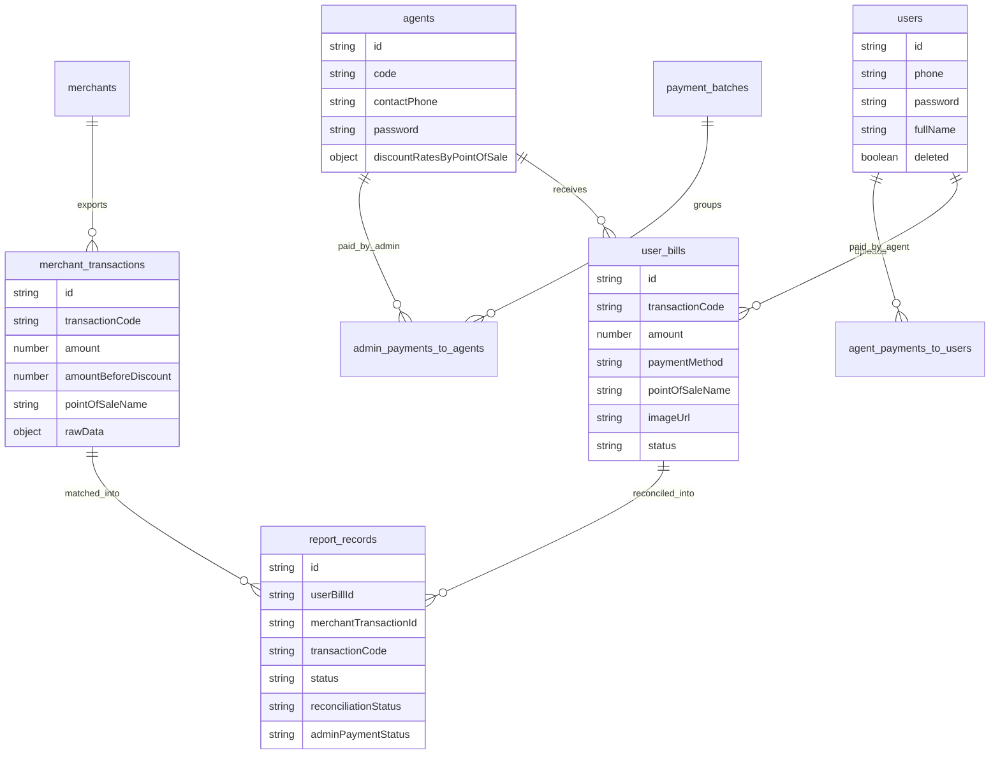
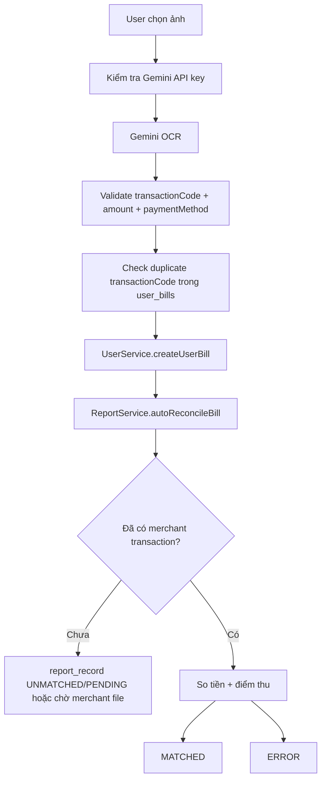
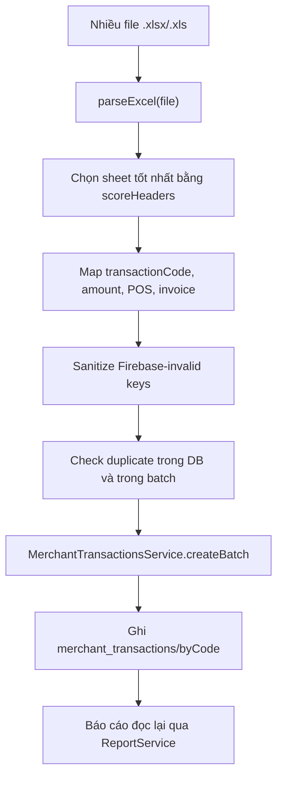

# MINI RECONCILE - ĐẶC TẢ KỸ THUẬT

> **Phiên bản tài liệu**: 2026-05-26
> **Mục đích**: giải thích cách hệ thống đối soát hoạt động, vì sao các quyết định hiện tại tồn tại, và những điểm cần giữ khi tiếp tục phát triển.

---

## Mục lục

1. [Tổng quan](#1-tổng-quan)
2. [Bài toán kỹ thuật](#2-bài-toán-kỹ-thuật)
3. [Kiến trúc runtime](#3-kiến-trúc-runtime)
4. [Data model](#4-data-model)
5. [Business logic đối soát](#5-business-logic-đối-soát)
6. [AI và Excel ingestion](#6-ai-và-excel-ingestion)
7. [Auth và quyền truy cập](#7-auth-và-quyền-truy-cập)
8. [Thanh toán và công nợ](#8-thanh-toán-và-công-nợ)
9. [Legacy traces](#9-legacy-traces)

---

## 1. Tổng quan

### 1.1 Mini Reconcile là gì?

Mini Reconcile là hệ thống đối soát payment vận hành trên một single-page app. Nó phục vụ ba nhóm người dùng:

| Nhóm | Việc chính | Dữ liệu tạo ra |
|---|---|---|
| User | Up ảnh bill thanh toán | `user_bills`, `user_bill_sessions` |
| Agent | Theo dõi bill, công nợ và thanh toán | `agent_reconciliation_sessions`, `agent_payments_to_users` |
| Admin | Import file merchant, đối soát, quản lý điểm bán/đại lý, xuất báo cáo | `merchant_transactions`, `report_records`, `payment_batches`, `admin_payments_to_agents` |

Hệ thống hiện không có backend riêng. React app gọi trực tiếp Firebase Realtime Database và Gemini API từ trình duyệt.

### 1.2 Luồng dữ liệu lõi



### 1.3 Source anchors

| Phần | Source chính |
|---|---|
| Routing | `App.tsx` |
| Gemini OCR | `services/geminiService.ts` |
| Firebase config | `src/lib/firebase.ts` |
| Bill/user services | `src/lib/userServices.ts` |
| Report merge/reconcile | `src/lib/reportServices.ts` |
| Merchant/agent/payments services | `src/lib/firebaseServices.ts` |
| Agent reconcile | `src/lib/agentReconciliationServices.ts` |
| Excel parsing | `src/utils/excelParserUtils.ts` |
| Excel export | `src/utils/excelExportUtils.ts` |
| Type model | `types.ts` |

---

## 2. Bài toán kỹ thuật

### 2.1 Mã chuẩn chi là khóa nghiệp vụ, nhưng không đủ một mình

Mã chuẩn chi là trường nối giữa ảnh bill và file merchant. Tuy vậy, code hiện tại không coi `transactionCode` là điều kiện duy nhất vì thực tế có thể gặp:

- bill trùng mã do user up lại;
- file merchant bị import nhiều lần;
- mã bị đọc nhầm từ OCR;
- mã bị parse nhầm từ Excel khi header không ổn định;
- giao dịch cùng mã nhưng sai số tiền hoặc sai điểm thu.

Vì vậy logic đối soát dùng ba lớp:

| Lớp | Vai trò |
|---|---|
| `transactionCode` | Tìm candidate |
| `amount` / `amountBeforeDiscount` | Xác nhận tiền thanh toán, cho phép sai số dưới 1 VND |
| `pointOfSaleName` | Chặn nhầm điểm thu khi cùng hệ thống có nhiều POS/merchant |

### 2.2 Vì sao cần `report_records` thay vì query động mỗi lần?

Nếu chỉ query `user_bills` + `merchant_transactions` mỗi khi mở báo cáo, kết quả lịch sử có thể đổi khi:

- user xóa/chỉnh bill;
- admin import lại file merchant;
- merchant transaction bị deduplicate;
- trạng thái thanh toán được revert;
- điểm thu được gán lại thủ công.

`report_records` lưu snapshot các field quan trọng từ cả hai phía. Đây là quyết định đúng cho hệ thống có audit trail và thao tác chỉnh tay.

Tradeoff: dữ liệu bị denormalize, nên code phải đồng bộ cẩn thận khi cập nhật trạng thái thanh toán hoặc sửa thủ công.

### 2.3 Vì sao Excel parser phải nhiều heuristic?

File merchant không được model hóa như API cố định. `parseExcel()` phải:

- chọn sheet có khả năng là dữ liệu giao dịch bằng `scoreHeaders()`;
- thử nhiều dòng header (`range: 0..2`);
- bỏ sheet giống config/readme;
- nhận diện header bằng normalize tiếng Việt không dấu;
- fallback sang dò value nếu header không tìm được mã chuẩn chi;
- tránh lấy nhầm `pointOfSaleName` làm `transactionCode`;
- parse số tiền theo format Việt Nam và format quốc tế.

Đây là phần giải quyết dữ liệu đầu vào bẩn. Nếu bỏ heuristic và chỉ map cột cứng, hệ thống sẽ fail ngay khi file Excel đổi header hoặc lệch dòng header.

### 2.4 Vì sao OCR chạy client-side?

Luồng hiện tại cho phép user tự nhập Gemini API key ở màn upload. Lợi ích:

- không cần backend để proxy Gemini;
- triển khai nhanh trên Vercel;
- key có thể thay theo user/session;
- ảnh không phải đi qua server riêng của dự án.

Nhược điểm:

- key nằm trong `localStorage`;
- prompt và model call nằm ở client bundle;
- khó kiểm soát quota/cost tập trung;
- khó enforce policy server-side;
- ảnh bill được convert base64 và lưu vào Firebase, cần rule/retention rõ hơn.

Khi hệ thống chuyển sang sản xuất nghiêm túc, nên đưa OCR qua backend hoặc Cloud Functions để kiểm soát key, rate limit và audit.

---

## 3. Kiến trúc runtime

### 3.1 Sơ đồ runtime hiện tại



### 3.2 Tại sao SPA + Firebase?

| Lựa chọn | Ưu điểm | Nhược điểm |
|---|---|---|
| SPA + Firebase hiện tại | Không cần backend, realtime dễ, deploy đơn giản trên Vercel | Auth/rules phải rất chặt; logic nghiệp vụ nằm client; khó giữ bí mật AI key |
| Backend API riêng | Kiểm soát auth, rate limit, secrets, audit tốt hơn | Tăng chi phí triển khai và bảo trì |
| Serverless functions | Giữ được Vercel/Firebase nhẹ, có chỗ đặt secrets | Cần refactor call path OCR và reconciliation write path |

Quyết định hiện tại phù hợp với prototype/ops tool nội bộ hoặc giai đoạn triển khai nhanh. Với dữ liệu tài chính thực, nên nâng lên backend/serverless boundary.

### 3.3 Deploy

`vercel.json` cấu hình:

| Trường | Giá trị |
|---|---|
| Build | `npm run build` |
| Output | `dist` |
| Dev | `npm run dev` |
| SPA rewrite | `/(.*)` -> `/index.html` |

Vite config dùng `@vitejs/plugin-react`, alias `@` trỏ về root repo, dev server mặc định `0.0.0.0:3001`.

---

## 4. Data model

### 4.1 ERD mức nghiệp vụ



### 4.2 Firebase nodes quan trọng

| Node | Vai trò | Ghi chú |
|---|---|---|
| `users` | User cuối | Có soft delete; password hiện so sánh plain text |
| `agents` | Đại lý | Có `assignedPointOfSales`, `discountRatesByPointOfSale`, QR base64 |
| `merchants` | Điểm bán/merchant | Có `pointOfSaleName`, `adminAccounts`, fee structure |
| `user_bills` | Bill do user upload | `imageUrl` đang có thể là base64 ảnh |
| `merchant_transactions` | Dòng giao dịch từ Excel | Có `byCode` mapping để lookup nhanh |
| `report_records` | Kết quả đối soát snapshot | Source of truth cho báo cáo |
| `agent_reconciliation_sessions` | Phiên agent/admin đối soát agent bills | Có security check khi đọc/xóa theo agent |
| `admin_payments_to_agents` | Admin trả tiền cho agent | Liên kết `reportRecordIds` và batch |
| `agent_payments_to_users` | Agent trả tiền cho user | Liên kết bill ids |
| `payment_batches` | Lô chi trả | Có trạng thái `UNPAID`, `PAID`, `PARTIAL`, `CANCELLED`, `DRAFT` |
| `settings` | Cấu hình app | Company, timezone, currency, logo |

### 4.3 Vì sao có `merchant_transactions/byCode`?

Realtime Database không có query/index linh hoạt như SQL. `byCode` là index thủ công:

```text
merchant_transactions/byCode/{transactionCode} -> merchantTransactionId
```

`MerchantTransactionsService.getByTransactionCode()` ưu tiên `byCode`, sau đó fallback scan toàn bộ `merchant_transactions` để tương thích dữ liệu cũ.

Tradeoff: khi xóa hoặc deduplicate merchant transaction, code phải cập nhật lại mapping. `DeduplicateService.deduplicateMerchantTransactions()` đã xử lý việc này bằng batch `updates`.

---

## 5. Business logic đối soát

### 5.1 User up bill



Điểm đáng chú ý:

- User upload nhiều ảnh, từng ảnh được OCR và preview trước khi lưu.
- `UploadBill.tsx` lưu Gemini key trong `localStorage`.
- Duplicate check đang đọc `user_bills` toàn cục bằng `UserService.findBillByTransactionCode()`.
- Sau khi tạo bill, `ReportService.autoReconcileBill()` chạy ngay nhưng không làm fail bill creation nếu reconcile lỗi.

### 5.2 Admin import merchant Excel



Admin import không chỉ lưu file. Nó chuẩn hóa dữ liệu để các màn báo cáo có thể merge `merchant_transactions`, `user_bills` và `report_records`.

### 5.3 Merge báo cáo hiện tại

`ReportService.getAllReportRecordsWithMerchants()` làm ba việc:

1. Load toàn bộ `merchant_transactions`, `report_records`, `user_bills`.
2. Tạo map theo `transactionCode`.
3. Trả về records có merchant data, còn bill chưa có merchant transaction được tách sang pending bills panel.

Quyết định này quan trọng: admin report không bị trộn giữa “đã có file merchant nhưng sai” và “bill vẫn chờ merchant file”.

### 5.4 Trạng thái

| Entity | Status | Ý nghĩa |
|---|---|---|
| `UserBill.status` | `PENDING`, `MATCHED`, `ERROR` | Trạng thái bill ở phía user/agent |
| `ReportRecord.status` | `MATCHED`, `UNMATCHED`, `ERROR` | Kết quả reconcile giữa bill và merchant |
| `ReportRecord.reconciliationStatus` | `PENDING`, `MATCHED`, `ERROR`, `UNMATCHED` | Field mới để diễn giải rõ hơn pending/matched/error |
| `AdminPaymentStatus` | `UNPAID`, `PAID`, `PARTIAL`, `CANCELLED`, `DRAFT` | Trạng thái admin trả agent |
| `AgentPaymentStatus` | `UNPAID`, `PAID` | Trạng thái agent trả user |

### 5.5 Manual edit

Admin có modal sửa giao dịch trong `ReconciliationModule.tsx`. Khi chỉnh:

- cập nhật local state;
- tính lại `difference`;
- có `isManuallyEdited`;
- ghi `editedFields`;
- thêm `editHistory`;
- update Firebase qua `ReconciliationService.updateRecord()`.

Điểm cần giữ: manual edit không được âm thầm ghi đè nguồn bill/merchant nếu mục tiêu là sửa kết luận đối soát. Source hiện cập nhật record đối soát, không sửa trực tiếp `user_bills` hoặc `merchant_transactions`.

---

## 6. AI và Excel ingestion

### 6.1 Gemini OCR

Model đang dùng:

```text
gemini-2.5-flash
```

Prompt yêu cầu phân loại 4 loại bill:

| Bill | `paymentMethod` |
|---|---|
| VNPay | `QR 1 (VNPay)` |
| PhonePOS / POS | `POS` |
| VietinBank / App Bank | `QR 2 (App Bank)` |
| Sofpos | `Sofpos` |

Các field bắt buộc:

- `transactionCode`
- `amount`
- `paymentMethod`

Các field tùy chọn:

- `invoiceNumber`
- `pointOfSaleName`
- `bankAccount`
- `timestamp`

### 6.2 Retry AI

`retryWithBackoff()` retry lỗi 503, 429, unavailable, overloaded, rate limit và network. Delay hiện tại là 2s, 4s, 8s cho OCR image.

Đây là xử lý phù hợp với model hosted API vì lỗi quá tải/rate limit là lỗi tạm thời. Tuy vậy, retry chạy ở client nên không có global rate limit.

### 6.3 Excel parser

`src/utils/excelParserUtils.ts` xử lý:

- normalize tiếng Việt bằng NFD;
- đo score header;
- chọn sheet có `transaction`, `amount`, `date/time`;
- parse amount với dấu `.` và `,`;
- đoán mã giao dịch nếu header không ổn định;
- loại trừ header giống ngày, số tiền, địa chỉ, note, điểm thu.

`ReconciliationModule.tsx` bổ sung thêm các guard thực tế:

- không nhận file ngoài `.xlsx`/`.xls`;
- debug header dòng đầu;
- reset transaction code nếu trùng point-of-sale name;
- chỉ chọn numeric code dài khi phải fallback;
- track duplicate theo transaction code trong batch.

### 6.4 Excel export

`src/utils/excelExportUtils.ts` dùng `xlsx-js-style` để:

- tạo workbook;
- thêm metadata sheet;
- auto-size cột;
- detect number/date columns;
- ghi file bằng `XLSX.writeFile`.

Build hiện cảnh báo bundle lớn, trong đó Excel + Firebase + UI đóng góp đáng kể. Nếu app tiếp tục lớn, nên tách các màn export/import bằng dynamic import rõ ràng hơn.

---

## 7. Auth và quyền truy cập

### 7.1 Hiện trạng

| Nhóm | Cách đăng nhập hiện tại |
|---|---|
| Admin | mock login, set `localStorage.mockAuth = true` |
| User | đọc `users` từ Firebase, so phone + password plain text |
| Agent | đọc `agents` từ Firebase, so contactPhone + password plain text |

`src/lib/authServices.ts` có hàm PBKDF2 `hashPassword()` và `verifyPassword()`, nhưng luồng user/agent hiện vẫn so sánh password plain text. Đây là legacy/unfinished security path cần ghi rõ, không được mô tả như đã production-ready.

### 7.2 Protected routes

`App.tsx` dùng localStorage guard:

| Guard | Điều kiện |
|---|---|
| `ProtectedRoute` | `localStorage.mockAuth === "true"` |
| `ProtectedUserRoute` | tồn tại `localStorage.userAuth` |
| `ProtectedAgentRoute` | tồn tại `localStorage.agentAuth` |

Đây là client-side UX guard, không phải security boundary. Security thật phải nằm ở Firebase Database Rules hoặc backend. Repo hiện không có rules file trong source.

---

## 8. Thanh toán và công nợ

### 8.1 Hai chiều thanh toán


Hệ thống tách hai dòng tiền:

- Admin trả cho Agent: `admin_payments_to_agents`, `payment_batches`, `adminPaymentStatus`.
- Agent trả cho User: `agent_payments_to_users`, `agentPaymentStatus`.

### 8.2 Fee calculation

Fee ưu tiên `discountRatesByPointOfSale`:

```text
agent.discountRatesByPointOfSale[pointOfSaleName][paymentMethod]
```

Nếu không có, fallback về `agent.discountRates[paymentMethod]`. Điều này phản ánh migration từ chiết khấu global theo đại lý sang chiết khấu theo từng điểm thu.

### 8.3 Revert payment

Các service thanh toán có logic clear:

- `adminPaymentId`
- `adminBatchId`
- `adminPaidAt`
- `adminPaymentStatus`
- legacy `payments`
- legacy `reconciliation_records.paymentId`

Đây là dấu hiệu hệ thống đã đi qua ít nhất hai mô hình payment. Tài liệu cần giữ rõ để khi cleanup không xóa nhầm dữ liệu đang được màn cũ dùng.

---

## 9. Legacy traces

| Trace | Hiện trạng | Ý nghĩa khi sửa |
|---|---|---|
| `AgentSubmission` | Được đánh dấu deprecated, nhưng Gemini OCR vẫn trả object tương thích | Không xóa nếu chưa refactor toàn bộ OCR/UserBill |
| `discountRates` | Deprecated, fallback cho `discountRatesByPointOfSale` | Giữ cho dữ liệu agent cũ |
| `payments` | Legacy payment system, vẫn được cleanup trong batch delete/revert | Không xóa node hoặc service nếu chưa migrate dữ liệu |
| `reconciliation_records` | Luồng cũ song song `report_records` | Một số service vẫn đọc/ghi, đặc biệt dashboard legacy |
| PBKDF2 helpers | Có code hash/verify nhưng login dùng plain text | Cần migration password trước khi bật |
| Firebase Auth | Khởi tạo `auth` và persistence nhưng route auth custom | Không được mô tả là Firebase Auth production auth |
| `index.html` importmap | Còn dấu vết AI Studio/CDN imports | Vite vẫn build từ package dependencies; có thể dọn khi refactor build |

Legacy traces là dữ kiện kỹ thuật, không phải lỗi phải xóa ngay. Với hệ thống có dữ liệu tài chính, thứ cần tránh là cleanup một nhánh tưởng cũ nhưng vẫn đang là fallback vận hành.
