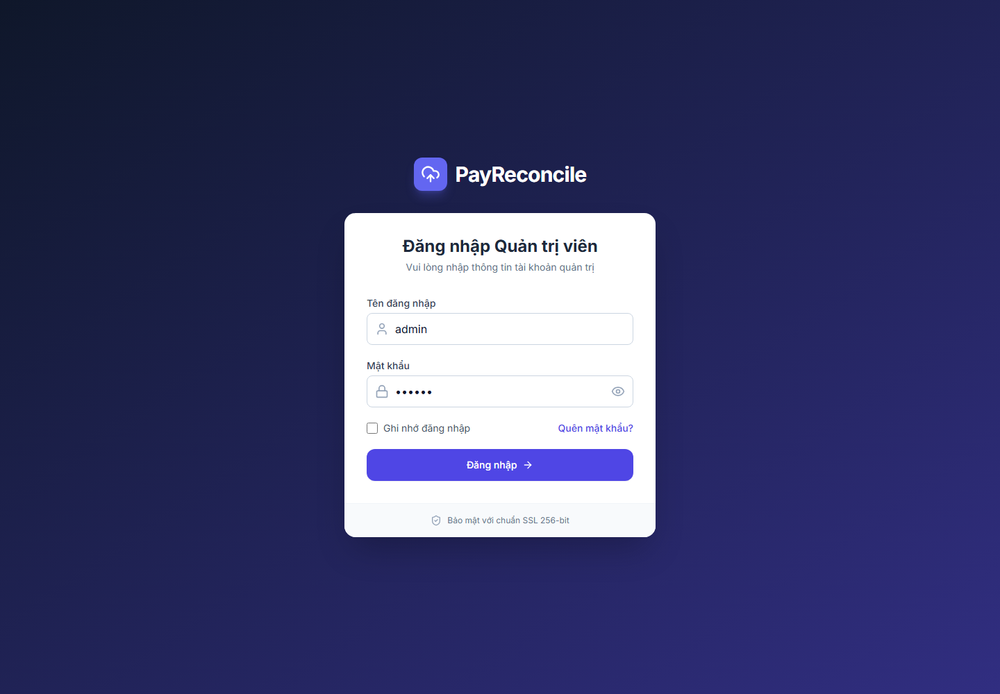
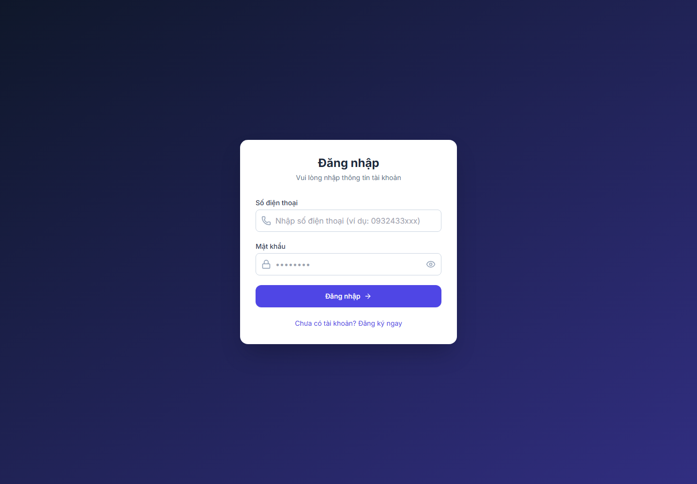
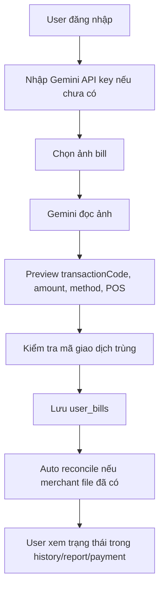
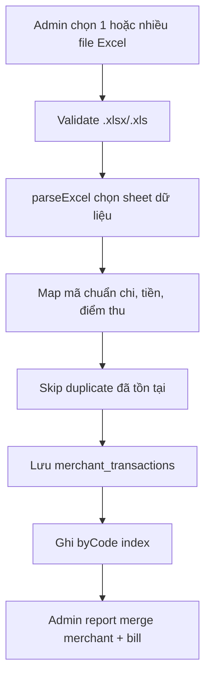
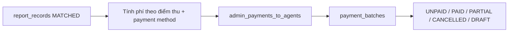

# MINI RECONCILE - LUỒNG NGHIỆP VỤ VÀ VẬN HÀNH

Tài liệu này mô tả cách người dùng thật đi qua hệ thống và những điểm vận hành phải kiểm tra khi xử lý lỗi đối soát.

---

## 1. Bề mặt sản phẩm

### 1.1 Homepage


Homepage chỉ làm một việc: đưa người dùng vào đúng vai trò. Code hiện có hai card công khai: `Đại lý` và `Người dùng`. Admin đi qua route `/admin`.

### 1.2 Admin login



Admin login hiện là mock. Form mặc định `admin / 123456` và luôn set `localStorage.mockAuth = true` sau submit. Đây là tiện cho demo và vận hành nội bộ, nhưng không phải cơ chế phân quyền sản xuất.

### 1.3 User login



User login đọc `users` từ Firebase Realtime Database, tìm đúng `phone`, bỏ qua user bị soft-delete, rồi so password plain text.

---

## 2. Luồng user up bill

### 2.1 Normal path



### 2.2 Failure path

| Điểm lỗi | Cách code xử lý | Người vận hành cần làm |
|---|---|---|
| Chưa có Gemini key | Không gọi OCR, hiển thị yêu cầu nhập key | Hướng dẫn user lấy key hoặc cấu hình env |
| Gemini quá tải/rate limit | Retry exponential backoff | Chờ retry; nếu vẫn fail, upload lại sau |
| OCR thiếu `transactionCode`, `amount`, `paymentMethod` | Throw error, không cho lưu bill hợp lệ | User kiểm tra ảnh rõ hơn hoặc nhập lại |
| Trùng mã giao dịch | `findBillByTransactionCode()` chặn upload duplicate | Admin kiểm tra bill cũ trước khi cho user upload lại |
| Chưa có merchant transaction | Bill nằm ở pending/chờ merchant file | Admin import file merchant đúng kỳ |

### 2.3 Dữ liệu ảnh

`UploadBill.tsx` convert ảnh thành base64 để preview/OCR và lưu vào `imageUrl`. `billImageUtils.ts` có logic cleanup ảnh hết hạn, nhưng cần kiểm tra rule và retention thực tế trước khi dùng dữ liệu nhạy cảm ở quy mô lớn.

---

## 3. Luồng admin import Excel

### 3.1 Normal path



### 3.2 Quy tắc parse thực tế

| Dữ liệu | Cách tìm |
|---|---|
| Mã chuẩn chi | Ưu tiên header chứa mã trừ tiền/mã chuẩn chi/mã giao dịch, fallback numeric code dài |
| Điểm thu | Header `điểm thu`, `point of sale`, `collection point` |
| Số tiền | Ưu tiên số tiền sau KM/trước KM/số tiền giao dịch, fallback numeric columns hợp lý |
| Ngày giao dịch | Header ngày/time/date nếu có |
| Raw data | Lưu toàn bộ cột sau khi sanitize key không hợp lệ với Firebase |

### 3.3 Vì sao không dùng schema Excel cứng?

File merchant là đầu vào vận hành, không phải API versioned. Header có thể lệch dấu, đổi tên, thêm dòng tiêu đề hoặc có nhiều sheet. Parser hiện được thiết kế để chịu được biến thể này.

Khi có file mới parse sai, không nên sửa bằng hardcode một file cụ thể. Nên bổ sung synonym hoặc scoring rule có kiểm soát trong `excelParserUtils.ts` và test lại các file cũ.

---

## 4. Luồng đối soát

### 4.1 Admin report merge

`ReportService.getAllReportRecordsWithMerchants()` là luồng đọc chính cho báo cáo admin. Nó chủ động trả về records đã có merchant data. Bills chưa có merchant data được đưa sang pending panel.

Điều này tạo hai trạng thái vận hành rõ:

- **Chờ file merchant**: user đã up bill, nhưng chưa có giao dịch merchant tương ứng.
- **Đã có merchant evidence**: có thể kết luận `MATCHED`, `ERROR`, hoặc `UNMATCHED`.

### 4.2 Agent reconcile

`AgentReconciliationService.reconcileAgentBills()` xử lý bills của một agent và match với merchant transactions theo:

```text
transactionCode + amount + pointOfSaleName
```

Hàm đọc pending bills của agent, cập nhật từng bill thành `MATCHED` hoặc `ERROR`, rồi tạo `agent_reconciliation_sessions`.

### 4.3 Chỉnh tay

Admin có thể chỉnh:

- mã chuẩn chi;
- số tiền merchant;
- số tiền agent;
- điểm thu;
- đại lý;
- ghi chú.

Sau chỉnh, record có:

- `isManuallyEdited = true`;
- `editedFields`;
- `editHistory`;
- `noteUpdatedAt`;
- `noteUpdatedBy`.

Vận hành nên coi manual edit là hành động có audit, không phải dữ liệu gốc.

---

## 5. Luồng thanh toán

### 5.1 Admin trả Agent



Fee ưu tiên cấu hình chiết khấu theo điểm thu:

```text
discountRatesByPointOfSale[pointOfSaleName][paymentMethod]
```

Nếu không có, hệ thống fallback về `discountRates[paymentMethod]`.

### 5.2 Agent trả User

Agent-to-user dùng `agent_payments_to_users` và trạng thái trả tiền trên bill/report. Đây là luồng độc lập với admin-to-agent để phản ánh thực tế: admin có thể đã thanh toán cho agent nhưng agent chưa thanh toán cho user.

### 5.3 Revert và xóa batch

Khi revert/xóa batch, code phải clear cả field mới và field legacy:

- `adminPaymentId`
- `adminBatchId`
- `adminPaidAt`
- `adminPaymentStatus`
- legacy `payments`
- legacy `reconciliation_records.paymentId`

Đây là vùng rủi ro cao. Không refactor payment service nếu chưa có snapshot dữ liệu thực và kịch bản rollback.

---

## 6. Báo cáo và export

### 6.1 Báo cáo admin

`AdminReport.tsx` load merchant transactions và report records, deduplicate theo `transactionCode`, filter theo ngày/trạng thái/search, rồi export Excel.

### 6.2 Báo cáo user/agent

User và agent đọc report records/bills theo quyền và route tương ứng. Các màn này ưu tiên câu hỏi vận hành:

- bill nào đã có file merchant;
- bill nào khớp;
- bill nào sai tiền hoặc sai điểm thu;
- bill nào đã được thanh toán.

### 6.3 Excel export

Export dùng `xlsx-js-style`; workbook thường có metadata sheet để giữ ngữ cảnh xuất báo cáo. Khi thêm báo cáo mới, nên giữ nguyên pattern:

1. chuẩn bị rows đã format;
2. xác định number/date columns;
3. thêm metadata;
4. export workbook với tên có ngày.

---

## 7. Checklist vận hành

Trước khi dùng dữ liệu thật:

- Kiểm tra Firebase Database Rules, vì repo không chứa rules file.
- Thay mock admin auth bằng auth thật.
- Migrate user/agent password khỏi plain text.
- Quyết định ảnh bill giữ bao lâu và cleanup bằng cơ chế nào.
- Kiểm tra Gemini key policy: user tự nhập key hay hệ thống sở hữu key.
- Test import Excel với ít nhất 3 mẫu merchant thật.
- Test duplicate transaction code ở cả user bill và merchant transaction.
- Test rollback batch thanh toán trước khi chạy lô thật.
- Kiểm tra bundle size nếu deploy trên mạng yếu.
