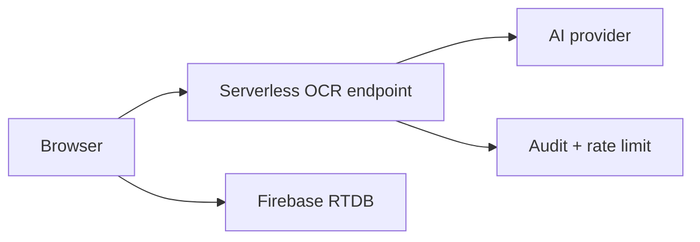

# MINI RECONCILE - BẢO TRÌ VÀ RISK REGISTER

Tài liệu này ghi những điểm không nên bị che bằng README đẹp. Đây là danh sách rủi ro kỹ thuật cần biết trước khi sửa core flow.

---

## 1. Verification hiện tại

Ngày kiểm tra: 2026-05-26.

| Gate | Kết quả |
|---|---|
| `npm ci` | PASS |
| `npm run build` | PASS |
| Playwright screenshot homepage | PASS |
| Playwright screenshot admin login | PASS |
| Playwright screenshot user login | PASS |
| GitHub Actions workflow | Không có workflow trong repo |

Build warnings:

```text
/index.css doesn't exist at build time
reportServices.ts is dynamically imported and statically imported
Some chunks are larger than 500 kB after minification
```

`npm ci` báo 14 vulnerabilities tại thời điểm kiểm tra. Chưa chạy `npm audit fix` vì đó có thể kéo theo thay đổi dependency ngoài phạm vi docs.

---

## 2. Risk register

| Mức | Rủi ro | Bằng chứng source | Hướng xử lý |
|---|---|---|---|
| Critical | User/agent password đang so plain text | `src/lib/authServices.ts` | Migrate hash PBKDF2 hoặc Firebase Auth thật; không chỉ bật helper có sẵn |
| Critical | Client-side guard không phải security boundary | `App.tsx` protected routes dựa localStorage | Cần Firebase Rules/backend auth |
| High | Gemini API key nằm ở client/localStorage | `services/geminiService.ts`, `UploadBill.tsx` | Đưa OCR qua backend/serverless nếu dùng production |
| High | Ảnh bill có thể lưu base64 trong RTDB | `UserBill.imageUrl`, `UploadBill.tsx` | Chuyển object storage + signed URL + retention |
| High | Firebase config public nhưng không có rules trong repo | `src/lib/firebase.ts` | Commit rules hoặc tài liệu deploy rules riêng |
| Medium | Parser Excel phụ thuộc heuristic | `src/utils/excelParserUtils.ts`, `ReconciliationModule.tsx` | Tạo fixture Excel thật và regression tests |
| Medium | Bundle quá lớn | build warning | Code split import/export/report modules |
| Medium | `reportServices.ts` import hỗn hợp | build warning | Chuẩn hóa static/dynamic import theo route-level splitting |
| Medium | `index.html` còn importmap/CDN và `/index.css` | `index.html` | Dọn dấu vết AI Studio khi refactor build |
| Medium | Hai data path report legacy/current song song | `reconciliation_records` và `report_records` | Migration plan trước khi xóa |

---

## 3. Dọn dẹp đã thực hiện trong docs pass

- Thay README bị mojibake bằng README tiếng Anh/Việt có badge và ảnh đúng.
- Đưa screenshot mới vào `docs/assets/`.
- Xóa ảnh cũ trong `assets/` có tên file chứa đường dẫn tuyệt đối từ máy cũ.
- Xóa `docs/screenshot.png` ở root docs để tránh asset rải rác.

Không thay đổi file source core.

---

## 4. Quy tắc khi sửa core

### 4.1 Không sửa reconciliation bằng cảm tính

Trước khi đổi `ReportService.getAllReportRecordsWithMerchants()` hoặc `autoReconcileBill()` cần có case test cho:

- merchant có transaction code nhưng không có bill;
- bill có transaction code nhưng chưa có merchant;
- bill và merchant cùng code nhưng sai tiền;
- bill và merchant cùng code/tiền nhưng sai điểm thu;
- duplicate merchant transaction;
- duplicate user bill;
- manual edit sau khi đã reconcile;
- batch payment đã paid rồi revert.

### 4.2 Không xóa legacy node khi chưa biết dữ liệu thật

Các node/field legacy vẫn xuất hiện trong service:

- `payments`
- `reconciliation_records`
- `AgentSubmission`
- `discountRates`
- `paymentId`
- `isPaid`

Nếu muốn xóa, cần migration script hoặc xác nhận production không còn dữ liệu dựa vào các field này.

### 4.3 Không đưa thêm AI provider mới vào client nếu chưa có boundary

Hiện Gemini chạy client-side. Nếu đổi sang provider khác, nên sửa kiến trúc trước:



Mục tiêu là giữ API key, rate limit, retry, log lỗi và policy ở server boundary.

---

## 5. Roadmap kỹ thuật đề xuất

### 5.1 Hardening tối thiểu

1. Bỏ mock admin auth.
2. Hash password user/agent hoặc chuyển sang Firebase Auth.
3. Thêm Firebase Database Rules vào repo.
4. Chuyển ảnh bill sang Firebase Storage hoặc object storage.
5. Tách Gemini call khỏi client.

### 5.2 Reliability

1. Thêm fixture Excel thật cho parser.
2. Thêm unit tests cho `parseAmount()`, `guessTransactionCode()`, `getAllReportRecordsWithMerchants()`.
3. Thêm migration kiểm soát cho `report_records` và legacy `reconciliation_records`.
4. Thêm job deduplicate có dry-run trước khi apply.

### 5.3 Maintainability

1. Dọn importmap trong `index.html`.
2. Loại `/index.css` nếu không dùng.
3. Code split các route nặng: reports, reconciliation, payouts.
4. Chuẩn hóa tiếng Việt source nếu còn file bị encoding sai trong editor/console.
5. Tách service layer thành modules theo domain: auth, bills, merchant imports, reports, payments.

---

## 6. Khi review PR

PR chạm vào các file sau phải review như thay đổi nghiệp vụ, không coi là UI-only:

| File | Lý do |
|---|---|
| `src/lib/reportServices.ts` | Source of truth merge/reconcile/report |
| `src/lib/firebaseServices.ts` | Merchant, agent, payment, session operations |
| `src/lib/userServices.ts` | Bill creation and pending bill logic |
| `src/lib/agentReconciliationServices.ts` | Agent-scoped reconcile and delete session |
| `src/utils/excelParserUtils.ts` | Chất lượng import merchant |
| `services/geminiService.ts` | OCR contract and provider behavior |
| `types.ts` | Data model contract |

Nếu thay đổi một trong các file này, cần chạy ít nhất:

```bash
npm run build
```

Và kiểm tra thủ công:

- upload bill OCR;
- import merchant file;
- báo cáo admin;
- pending bills panel;
- payment batch flow;
- revert payment/batch.
